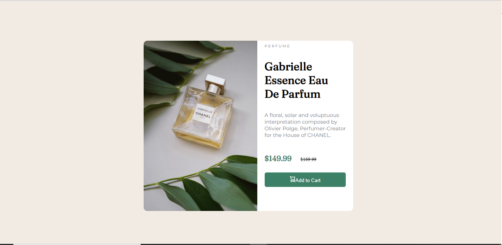

# Frontend Mentor - Product preview card component solution

## Table of contents

- [Screenshot](#screenshot)
- [Built with](#built-with)
- [Useful resources](#useful-resources)
- [Author](#author)

**Note: Delete this note and update the table of contents based on what sections you keep.**

## Overview

### Screenshot

Add a screenshot of your solution. The easiest way to do this is to use Firefox to view your project, right-click the page and select "Take a Screenshot". You can choose either a full-height screenshot or a cropped one based on how long the page is. If it's very long, it might be best to crop it.

Alternatively, you can use a tool like [FireShot](https://getfireshot.com/) to take the screenshot. FireShot has a free option, so you don't need to purchase it. 

Then crop/optimize/edit your image however you like, add it to your project, and update the file path in the image above.

**Note: Delete this note and the paragraphs above when you add your screenshot. If you prefer not to add a screenshot, feel free to remove this entire section.**

### Built with

- Semantic HTML5 markup
- CSS 

### Useful resources

- (https://css-tricks.com) - This helped me center the image and container

- Frontend Mentor - [@Omae1](https://www.frontendmentor.io/profile/Omae1)

